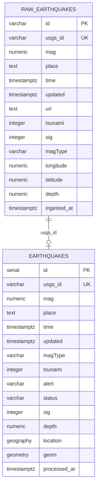

# ERD - Modelo Entidad-Relacion

Este modelo separa los datos crudos de USGS de la tabla final optimizada para consultas espaciales.

## Estrategia

| Tabla | Proposito |
| ----- | --------- |
| `raw_earthquakes` | Conserva la respuesta de USGS con coordenadas numericas y metadatos completos. |
| `earthquakes` | Tabla final con `GEOGRAPHY(Point, 4326)` y `GEOMETRY(Point, 4326)` para consultas espaciales. |

## Normalizacion

- Se mantiene una tabla raw para preservar la fuente original.
- La tabla final contiene los campos necesarios para API, dashboard y analisis geoespacial.
- `usgs_id` es la clave logica para upserts y evita duplicados.
- `location` se usa para distancias precisas en metros.
- `geom` se usa para indices GIST y operaciones geometricas.
